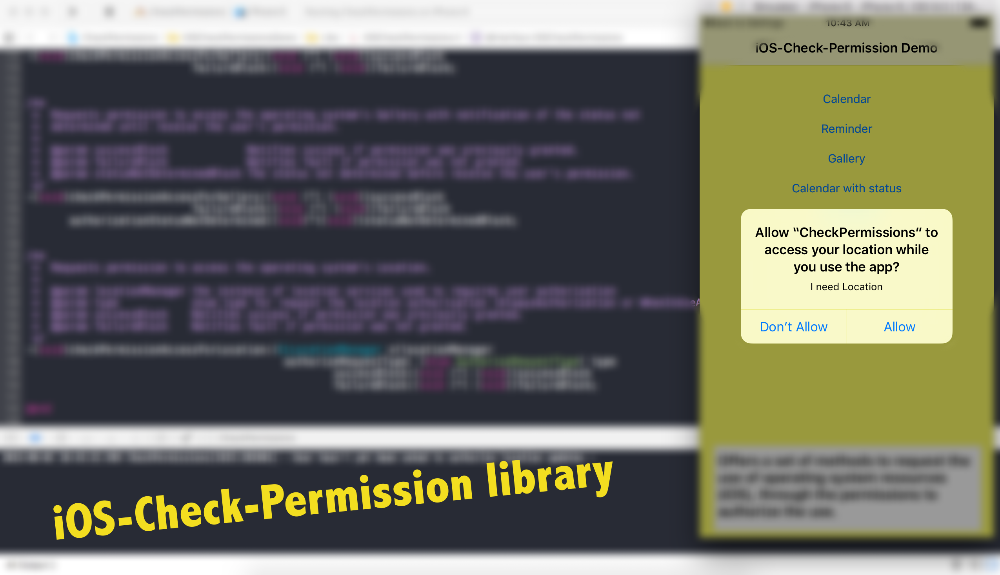
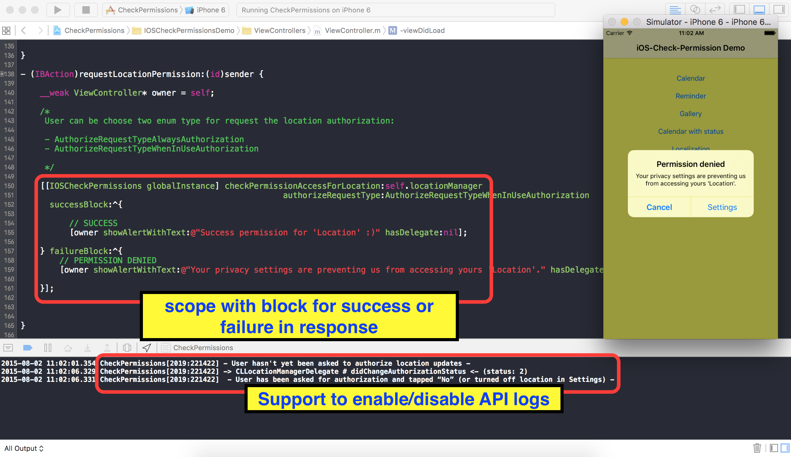

##iOS-Check-Permission

With this library you can request permission from camera features, reminders, gallery and location (GPS support). When requesting the resource use the library responds by using iOS blocks with authorized or denied access.

## CocoaPod

[](https://travis-ci.org/Douglas Frari/iOS-Check-Permission)
[](http://cocoapods.org/pods/iOS-Check-Permission)
[](http://cocoapods.org/pods/iOS-Check-Permission)
[](http://cocoapods.org/pods/iOS-Check-Permission)


## Requirements

```ruby
iOS 8 or higher
```


#See more on Youtube video:

- https://www.youtube.com/watch?v=JxdlaEp6dC0

<a href="https://www.youtube.com/embed/JxdlaEp6dC0"></a>


Requests permission to access the iOS (Calendar, Reminder, Gallery and Location), with
 option of receive the notification of the status not determined until receive the user's permission.

##Example of use:

 

There are 7 methods to use in the library:

```objective-c
- (void)checkPermissionAccessForCalendar:(void(^)(void))successBlock 
                             failureBlock:(void(^)(void))failureBlock;

- (void)checkPermissionAccessForCalendar:(void(^)(void))successBlock
                           failureBlock:(void(^)(void))failureBlock
       authorizationStatusNotDetermined:(void(^)(void))statusNotDeterminedBlock;

- (void)checkPermissionAccessForReminder:(void(^)(void))successBlock
                             failureBlock:(void(^)(void))failureBlock;

- (void)checkPermissionAccessForReminder:(void(^)(void))successBlock
                             failureBlock:(void(^)(void))failureBlock
         authorizationStatusNotDetermined:(void(^)(void))statusNotDeterminedBlock;

- (void)checkPermissionAccessForGallery:(void (^) (void))successBlock
                             failureBlock:(void (^) (void))failureBlock;

- (void)checkPermissionAccessForGallery:(void (^) (void))successBlock
                            failureBlock:(void (^) (void))failureBlock
        authorizationStatusNotDetermined:(void(^)(void))statusNotDeterminedBlock;
 
- (void)checkPermissionAccessForLocation:(enum AuthorizeRequestType) type
                                                  successBlock:(void (^) (void))successBlock
                                                  failureBlock:(void (^) (void))failureBlock;
```

## Usage

To run the example project, clone the repo, and run `pod install` from the Example directory first.


## Installation

iOS-Check-Permission is available through [CocoaPods](http://cocoapods.org). To install
it, simply add the following line to your Podfile:

```ruby
pod "iOS-Check-Permission"
```

## For download the Demo sample example, use: 

```ruby
pod try iOS-Check-Permission
```

## Author

Douglas Frari - http://www.twitter.com/douglasddf (twitter)

## License

iOS-Check-Permission is available under the MIT license. See the LICENSE file for more info.

